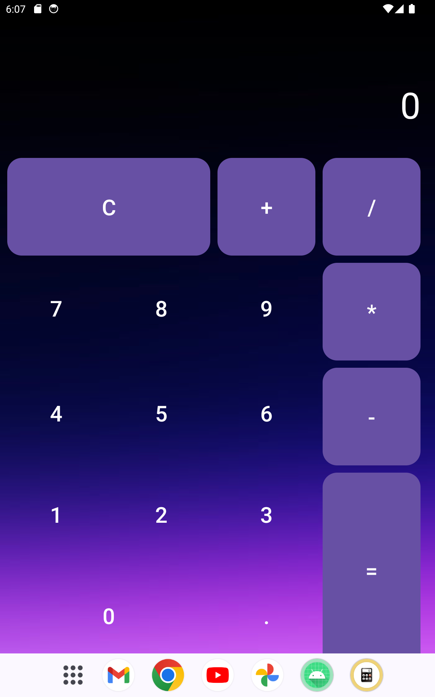

## Calculator App
**This is a simple calculator app built using Android Studio, Kotlin, and XML. The app provides basic mathematical operations like addition, subtraction, multiplication, and division. It is designed with a clean, user-friendly interface for quick and easy calculations.**

## Screenshots
<div align="center">
  
</div>

## Video demo
<div align="center">
  
</div>
 
## Features
- Addition: Add two numbers.
- Subtraction: Subtract one number from another.
- Multiplication: Multiply two numbers.
- Division: Divide one number by another.
- Clear: Reset the input fields.
 
## Technologies Used
- **Android Studio: IDE used for development.**
- **Kotlin: Primary programming language for the app.**
- **XML: Used for designing the user interface (UI).**
  
## Getting Started
**Prerequisites**
- Android Studio: Make sure Android Studio is installed on your machine.
- Kotlin Plugin: Kotlin is required to run this app. Ensure the Kotlin plugin is enabled in Android Studio.

## Installation
- **Clone the repository:**
```bash
git clone https://github.com/your-username/calculator-app.git
```
- **Open the project in Android Studio.**
- **Sync the Gradle files.**
- **Run the app on an emulator or physical Android device.**

